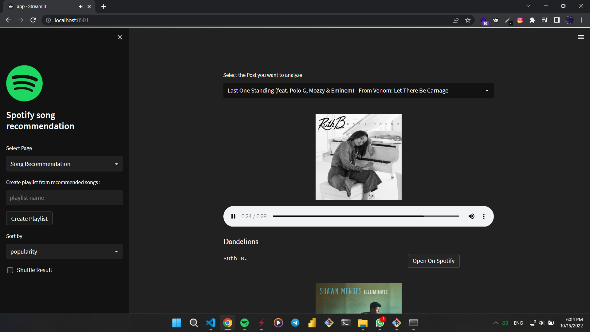
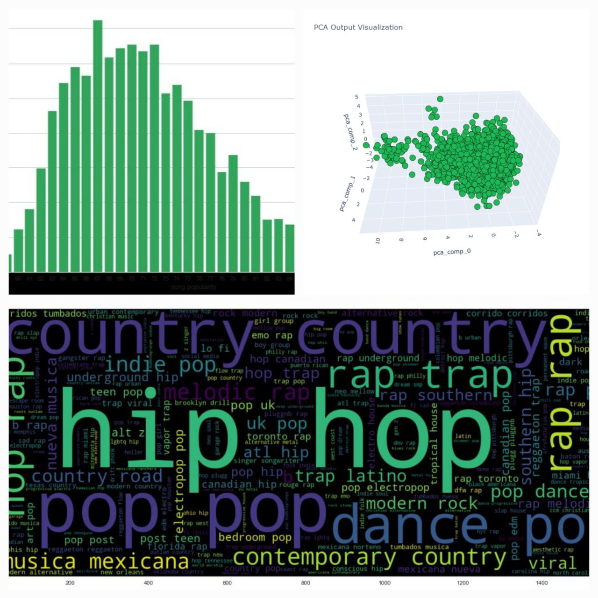
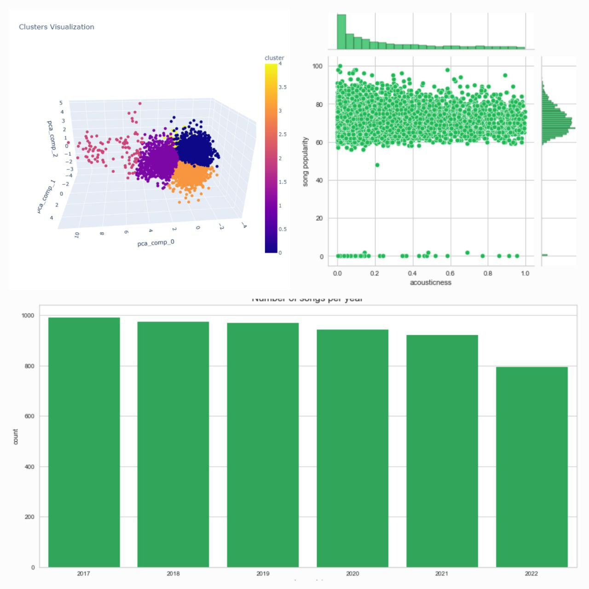
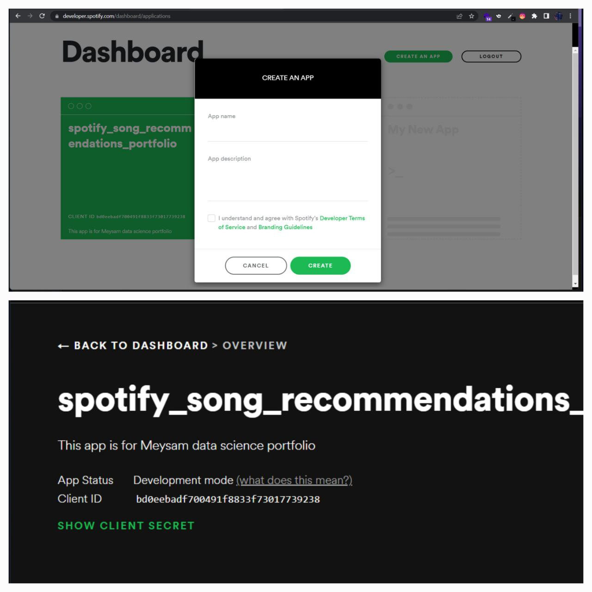

    <h1 style="font-size: 47px; line-height: 1; display: flex; align-items: center;">
        
        Recommendation System 🎧
    </h1>

## Project Overview

This project leverages data collected from Spotify, an audio streaming and media services provider, to create a **Recommendation System**. The system suggests songs based on audio features, genres, artists, and other attributes.

This project is part of my **portfolio**, highlighting my expertise in data science and development. While the main code isn't publicly accessible, I'm open to **collaboration**!  
📧 Email me at: **jvrinku@gmail.com**

### Demo Links  
- **Streamlit Version**: [Spotify Recommendation System Demo](https://meysamraz-song-recommendation-spotify-project.streamlit.app/)  
- **Heroku Version**: [Spotify Recommendation System Demo (Heroku)](https://spotify-song-recommendation.herokuapp.com/)  

  *Note*: Heroku may discontinue free hosting; if this link doesn't work, use the Streamlit demo above.

---

## Key Features

- **Personalized Recommendations**:
  - Based on audio features, genres, and artists.
- **User-Friendly Interface**:
  - Built with Streamlit for seamless navigation.

  

- **Data Visualization**:
  - Insights into song popularity, duration, and clustering outcomes.

  
  

---

## Project Workflow

### 1. Setup Spotify API
- Navigate to Spotify Developer Dashboard.
- Create an app and retrieve your `client_id` and `client_secret`.

### 2. Data Collection
- Collect songs between 2017-2022 (1000 per year).  
- Key data points:
  - **Song Details**: ID, name, artist name, release date, song link, album image.
  - **Audio Features**:
    - *Danceability*: Suitability for dancing.
    - *Acousticness*: Presence of acoustic elements.
    - *Energy*: Intensity and activity measure.
    - *Valence*: Musical positivity.
    - Other features like tempo, loudness, and liveness.

### 3. Data Understanding
- Analyze data structure and handle null values.
- Explore correlations between features.

### 4. Data Cleaning
- Drop unused columns (e.g., album genres).
- Format artist genres for analysis.

### 5. Data Analysis
- Visualize song data:
  - Songs per year.
  - Distribution of duration and popularity.
  - Artist genres using **WordCloud**.
- Analyze audio feature patterns.

### 6. Dimensionality Reduction
- Standardize audio features with **StandardScaler**.
- Apply **PCA** for reducing dimensions.
- Visualize reduced data.

### 7. Clustering
- Use **KMeans Clustering**:
  - Determine the optimal `k` value.
  - Visualize clustered data.

### 8. Recommendation System
- Suggest songs based on similarity of audio features, genres, and artists.

### 9. User Interface
- Built with **Streamlit** for interactive recommendations.

### 10. Deployment
- Hosted on **Heroku** and **Streamlit**:
  - Flexible platforms for showcasing the application.

---

## Libraries and Frameworks Used

- **Data Handling**: pandas, numpy
- **Visualization**: plotly, matplotlib, seaborn, wordcloud
- **Clustering**: yellowbrick, scikit-learn
- **UI Development**: Streamlit
- **Web Scraping**: BeautifulSoup

---

## Contact Me

Have questions or want to collaborate?  
📧 **jvrinku@gmail.com**
